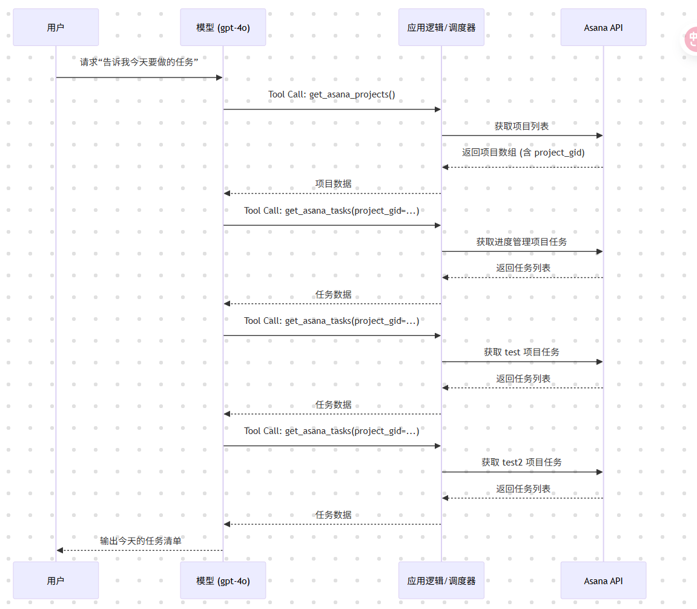

用户输入：我今天有哪些任务要做

控制台输出流程：
调用流程输出.md文件中查看

解释这段langgraph的调用流程

我帮你把这段 Asana 任务查询的执行流程梳理成一个逻辑链，你会发现它其实是一个 **LLM → 工具调用 → 结果返回** 的多轮交互循环。

---

## 1. **第一步：模型决定调用工具**

```
Response from model:
content=''
additional_kwargs={
    'tool_calls': [
        {
            'id': 'call_ZkyXYaKqL3JUbnrPo81LiYk8',
            'function': {'arguments': '{}', 'name': 'get_asana_projects'},
            'type': 'function'
        }
    ]
}
```

* **含义**：
  模型（`gpt-4o`）分析用户请求后，发现需要获取 Asana 项目列表，于是返回一个 **tool call** 指令。
* `name: 'get_asana_projects'` → 工具名（获取所有项目）。
* `arguments: {}` → 没有额外参数，直接列出全部项目。

> 这里模型并没有直接返回文字，而是告诉系统：“去调用 `get_asana_projects()` 函数，把结果给我。”

---

## 2. **第二步：调用工具 `get_asana_projects`**

* 系统（你的应用）接收到工具调用请求，执行 API 调用，返回项目列表给模型。
* 模型得到这些项目数据后，知道每个项目的 `project_gid`（项目 ID）。

---

## 3. **第三步：模型再次发起工具调用（批量查询任务）**

```
'tool_calls': [
    {'name': 'get_asana_tasks', 'args': {'project_gid': '1211019172285830'}},
    {'name': 'get_asana_tasks', 'args': {'project_gid': '1211019173449591'}},
    {'name': 'get_asana_tasks', 'args': {'project_gid': '1211019173449594'}}
]
```

* 模型用获取到的项目 ID 批量调用 `get_asana_tasks`，一次查多个项目的任务列表。
* 这里是 **并行批量调用**，意味着系统会同时查这三个项目的任务。

---

## 4. **第四步：工具返回任务数据**

* 每个 `get_asana_tasks` 调用返回一个任务数组，包括：

  * 任务标题
  * 截止日期
  * 状态
* 系统把这些结果交回给模型。

---

## 5. **第五步：模型整理输出**

```
今天你有以下任务要完成：

进度管理项目：
- 草拟专案简介（截止日期：2025-08-13）

test项目：
- （没有任务）

test2项目：
- 这些任务都已经过期，所以没有今日的任务。
```

* 模型根据日期筛选出 **今天的任务**，并把它们按项目分组输出。
* 这个就是你看到的最终自然语言结果。

---

## 6. **你看到的“重复片段”是怎么回事？**

* 日志里多次出现：

  ```
  'tool_calls': [{'name': 'get_asana_tasks', ...}]
  ```

  是因为这个调用链**循环执行**了几次，可能是：

  * **多个中间节点重复调度**（比如 LangChain/LangGraph 在状态回溯时重新执行了一轮工具调用）。
  * 或 **日志打印了多次相同请求**（每个 run 都被记录）。
* 这不影响最终逻辑，只是让日志看起来“很啰嗦”。

---

## 流程图

```
用户请求 → 模型判断需要项目数据
        → Tool Call: get_asana_projects()
        → 系统调用 Asana API → 返回项目列表
        → 模型发起多个 Tool Call: get_asana_tasks(project_id)
        → 系统调用 API → 返回任务列表
        → 模型整理 → 输出今天的任务清单
```

---

如果你愿意，我可以帮你画一个 **调用链时序图**，把这几个 `tool_call` 的先后关系和数据流一次画清楚。
这样你就能一眼看懂为什么日志会出现这么多重复调用。


sequenceDiagram
    participant User as 用户
    participant LLM as 模型 (gpt-4o)
    participant App as 应用逻辑/调度器
    participant Asana as Asana API

    User->>LLM: 请求“告诉我今天要做的任务”
    
    %% Step 1: 获取项目列表
    LLM->>App: Tool Call: get_asana_projects()
    App->>Asana: 获取项目列表
    Asana-->>App: 返回项目数组 (含 project_gid)
    App-->>LLM: 项目数据
    
    %% Step 2: 获取各项目任务
    LLM->>App: Tool Call: get_asana_tasks(project_gid=...)
    App->>Asana: 获取进度管理项目任务
    Asana-->>App: 返回任务列表
    App-->>LLM: 任务数据
    
    LLM->>App: Tool Call: get_asana_tasks(project_gid=...)
    App->>Asana: 获取 test 项目任务
    Asana-->>App: 返回任务列表
    App-->>LLM: 任务数据
    
    LLM->>App: Tool Call: get_asana_tasks(project_gid=...)
    App->>Asana: 获取 test2 项目任务
    Asana-->>App: 返回任务列表
    App-->>LLM: 任务数据
    
    %% Step 3: 输出结果
    LLM-->>User: 输出今天的任务清单


